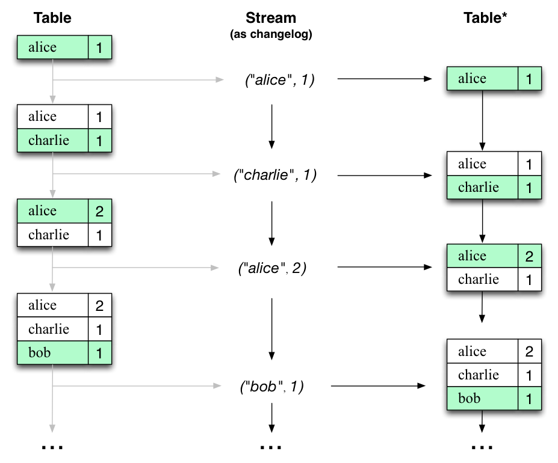
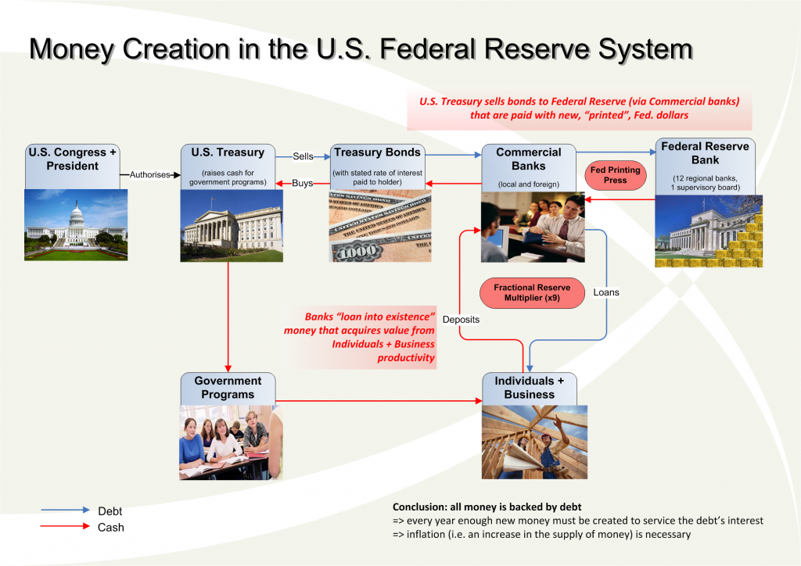
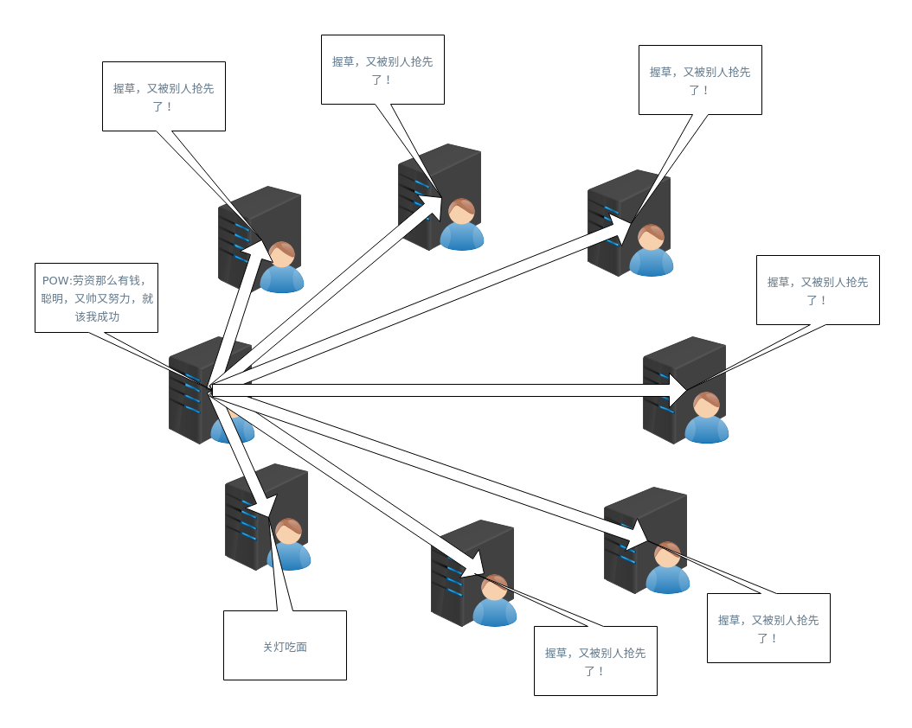
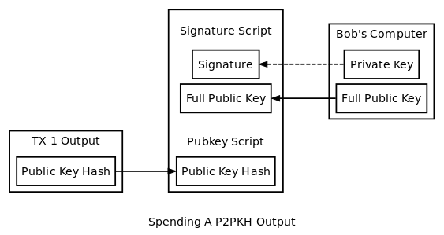
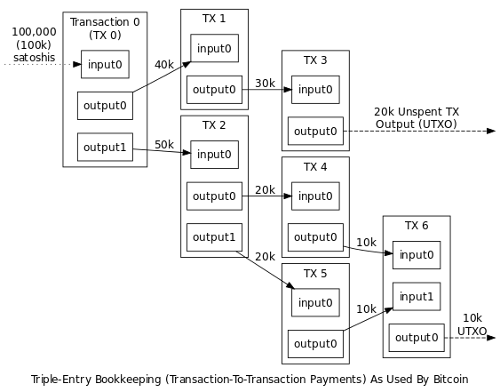
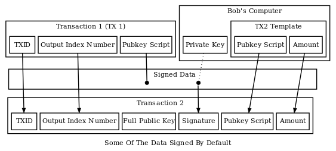
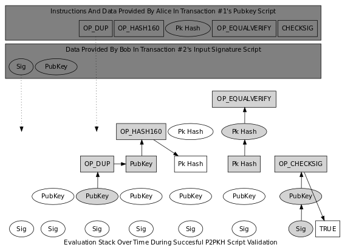

# 前言

这是区块链相关知识的一个梳理，旨在真正的get the skill并方便他人。

知识可分为两类:

* **逻辑体系型的**

  需要思考，把各种概念连起来，或归纳，或演绎，最后，在大脑中形成一种逻辑网状结构。比如可计算理论，分布式系统，解释器等。

* **使用操作型的**

  基本不需要思考，只需要看一下目录，要用的时候参考一下手册即可。比如linux的各种命令，go,python的一些奇怪语法,elastic-search dsl的使用。

第一类知识是比较有意思的，值得多花时间，这种"逻辑网状结构"最后会形成一个"打通"的集群，可能会让你的大脑产生一些有意思的想法；而第二类，千万别花太多时间，因为很有可能让你产生消极，厌学，忧郁等情绪，而你越努力，就越可能"斯德哥尔摩"。

区块链知识可以归为第一类。

研究一个东西，需要知道它包含哪些概念，我把它分为两类:

* **自描述概念**

  不依赖其他概念的概念
* **他描述概念**

  需要依赖其他概念的概念

显然，这是一个递归的概念，可以用形式化的语言来描述，你也可以哲学的扯一大堆，但这不是我的兴趣。

下面的章节试图用*原理，逻辑，应用*的方式把区块链相关的概念连起来，形成”网状结构“，所有概念可在[**Glossary(词汇表)**](./glossary.md)里查看，你可以先浏览一下，想一想他们之间的关系，再来看下面的章节。当然，最后，每个人的"网状结构"可能都不同，毕竟除了"同一性"，还有"差异性"。但，原则是一致的，有了"网状结构"，在添加新的"概念"时，我们就可以审视其在"网"中的位置，也可以思考这张"网"还缺少什么，有什么不完美之处，是不是还有"孤岛"等问题，进而有可能去完善它。

而所有的学习，无非就是完善那张网，并尽可能的正交。

这样，垃圾少了，人也轻松了。

# 原理

## 1. KV(key value)

>There are only two hard things in Computer Science: cache invalidation and _**naming things**_.
>
>-- Phil Karlton

为什么名字那么重要？因为有了名字，这个名字才能够被引用，才能够谈论其属性。

就是说，你要谈论一个人，首先得有这个人，这有点废话，但却是原理性的，

名字意味着什么？

图灵机里面的head,没错，只有你找到head,才知道当前的(input,state),才能往下走。

汇编语言如果没有address,存储和操作也没法进行;各种编程语言的变量说的也是这个事情。

而kv中的k其实就是名字，v在不同的场合可以有不同的含义。

有了kv,就可以构造所有的数据结构，因为从递归的角度，v也可以是kv。

这个跟blockchain有关系吗？

## 2. Asset(资产)

在digital asset的世界，address上的数字就是资产。显然，address是key,数字是value。
理解这一点很重要，blockchain主要主要的应用场景就是数字资产。

不太精确的分类:

* 资产数字化

  相当于一个凭证，其有现实的对应物，比如股票，其实对应公司的投票分红等权利。

* 数字资产化

  没有现实的对应物，但是可以换成现实中的钱，比如比特币。

## 3. Transaction(交易)

而address上的数字的变更，也就是kv的变化，对应着资产的转移，就是**交易(transaction)**。

如果能把所有KV的变化按顺序记录起来，就达到了**可溯源**的目的，这跟kafka里面的stream和table的关系是一样的。



可以看出，我们可以根据交易记录，来得到目前每个地址的资产；而资产的变化必须以目前的资产为前提。

事实上，这个保证是consensus mechanism(共识机制)里面的一个检查点。

## 4. Currency issuance(货币发行)

那么资产从哪里来呢？

上帝说，要有光就有了光。

这里我们不去讨论历史，只从现实的货币发行制度以及比特币"怼"的方式阐述。

### 4.1 美元的发行流程



* 没钱花了，国会和总统授权财政部,发行国债
* 国债大部分卖给中国和日本，有钱了
* 又没钱花了，中国日本也不要，通过银行卖给美联储，有钱了，这个钱是凭空出来的，**Currency issuance(货币发行)** works
* 债券是有利率的，就是说偿还债务时需要比借的钱要多一些
* 而发行的钱=借出的钱，这多一些的钱从哪里来呢？
* 唯一的办法就是继续借，也就是继续发行，否则这个系统就没法运转下去

这个系统的必然结果是:

* inflation(通货膨胀)
* 在经济增长对货币需求量增加的情况下，债务只可能越来越大
* 但是，只要有信心，这个系统就可以一直运行下去
* 并且，似乎其还有一个作用，生产力高的人更容易获得金钱
* 因为如果你赚的钱如果不足以覆盖你使用钱的成本，你就会被淘汰
* 这个系统不完美，但支撑了资本主义的高速发展
* 似乎繁荣,萧条的周期跟这个系统有很大的关系
* 它还在高速运转

### 4.2 比特币的发行流程

比特币的创世区块，上面有一句话:

>“The Times 03/Jan/2009 Chancellor on brink of second bailout for banks"
“财政大臣站在第二次救助银行的边缘”

这句话是当天泰晤士报头版的标题。中本聪将它写进创世区块，不但清晰地展示着比特币的诞生时间，还表达着对旧体系的嘲讽。

银行家的贪婪，政府的监守自盗，大而不倒的把戏，已经有太多的批评，这里不再赘述。

试验性质的比特币，试图回答两个问题:

* 谁该拥有货币发行权
* 货币发行量由什么决定



比特币的答案是:

* 众生平等，你有我有全都有
* 货币发行量预期固定，每4年减半


这里有太多话题性的东西:

* 依靠算力真的能做到去中心化？公平？民主？
* 指数衰减的货币真的有利于经济发展？
* 这种越早加入网络越容易拥有更多资产的机制是传销吗?

这些东西都可以去讨论。

从技术的角度，这里对应着数据的记录和计算的机制，在 **distributed network(分布式网络)** 的环境下，就是所谓的 **consensus mechanism(共识机制)**。

## 5. Distributed network(分布式网络)

**一群人** **合作** 来 **搞事情**，就形成了网络。

这里的人叫node(节点),搞事情的过程中，一个不行了，另一个顶上，就叫failover。

常见的搞事情，比如LB,replica storage等。

这里的合作遵循的规则就叫 **consensus mechanism(共识机制)**。

如果这群人都很聪明，并且互相信任，事情会简单很多。

很多的系统都是以此为假设进行设计的。

区块链的假设是:节点之间是互相不信任的。

区块链要干的事情就是:设计一个能让互相**不信任**的节点都**信任**的机制,然后大家可以愉快的一起搞事情。

## 6. **Consensus mechanism(共识机制)**

在跟资产相关的世界里，这个机制需要做到:

* 确保某个address的数字只能由拥有它的人来操作
* 交易记录无法篡改
* 交易记录可追溯

比特币也是围绕这几个问题展开的，当然它还干了其他几件牛B的事情:

* 在去中心化的条件下解决spend twice的问题
* 防止通货膨胀的货币发行机制

**完全的去中心化**对区块链来说并不是一个必选项，就大部分的商业活动看，去中心化反而会增加很多不必要的复杂性。

发币也不是必选项。

我们先来看如何做到*确保某个address的数字只能由拥有它的人来操作*，*交易记录无法篡改*，*交易记录可追溯*

## 7. Cryptography(密码学)

### 7.1 Asymmetric cryptography(非对称加密)

* 公钥加密，只有对应的私钥能够解密

  加密货币中的address对应公钥(bitcoin的实现里面，为了隐藏身份，对public key做了hash),对该address的资产进行操作的唯一条件是:拥有对应的私钥。

* 私钥签名，公钥能够验证是不是对应的私钥签名的

  把公钥和签名广播出去，nodes可以验证交易的有效性。

* 篡改无效
  签名的信息确实是签名者本人的意愿，nodes能对此进行确认。

* PKI中利用CA颁发证书的方式来确定网络中的身份

  对于公有链，peer可以自由加入，退出，并不需要一个中心化的CA来对身份进行认证;联盟链，peer的身份和权限可利用该机制来实现，比如hyperledger中的msp

 比特币的交易:

  

这就回答了，如何做到**确保某个address的数字只能由拥有它的人来操作**的问题。

### 7.2 SHA(Secure Hash Algorithm)

* 任意长度的数据->固定长度的数据
* 相同input->相同output
* 冲突几率很小,改变input的一个字符，output都会不同
* 验证hash value很容易，反推很难
  >计算一个任意长度input的hash value非常快，但是给出一个output，要算出input却非常难，目前只有遍历试验的方法。Bitcoin中会根据目前的平均出块速度，给出一个ouput,谁先构造出hash(input)小于该output的数据，谁就拥有当前出块的权利。这个遍历试验的过程就叫做**挖矿(mining)**，当某个peer找到符合条件的input,它会广播给其他peer,其他peer对其进行验证，这个遍历试验并向大家证明的过程，就叫做**POW**;而每一次出块会有一定的奖励，这个奖励是比特币产生(coinbase)的唯一方式,而区块中确认交易的output和input的差额就是给记账peer的**手续费(transaction fee)**。

而做到交易记录**无法篡改**和**可追溯**,还需要block chain这种数据结构。

## 8. Hash chain && Block chain

block chain其实是一种特殊的hash chain。


首先，数据是存在分布式网络的各个节点中的，这些节点有可能有些是坏人，"不可篡改“是指整个分布式网络对外提供的block chain data是"不可篡改"的。恶意节点的篡改，得不到承认，并且不影响对外的服务。

比特币中的好人们商量好:我们只认best block chain,就是符合规则(consensus mechanism)并且最长的那条链。

下面结合block chain的具体结构和相应的consensus mechanism来说明,why"不可篡改"?

block chain数据结构的特点是:

* 链式存储，从任何一个block可以找到其前面的block
* 且每一个block(Genesis block除外)有上一个block的hash

由于hash的"**冲突几率很小,改变input的一个字符，output都会不同**"的特性，改变一个区块的数据将会导致后面区块的hash对不上，也许你会说,"改变后面block的hash不就行了？"，但是，由于后面的block也改变了，那么其hash也改变了，而一个block有效的一个必要条件:

>hash(block)<根据当前平均出块速度计算出的target

系统会计算当前1小时的平均出块速度，动态调整difficulty,得出一个target，而一个有效的区块，不但要拥有前一个区块的hash,还必须计算出一个nonce,使得当前block的hash值小于该target。

这意味着，改变任何一个block,并且想跟上目前最长的链，需要重做生成后面所有block的工作量。

而这是非常难的。

理论上，跟所有honest peers竞争，掌握51%以上的算力是有可能对数据进行篡改的，但是，假如你的算力真的非常强，你可以把交易都篡改了，这是否能让你的利益最大化呢？首先，这个篡改肯定会被发现，当honest peers发现很长的不匹配block时，会发出告警，然后用户也会知道，这会导致什么结果呢？一个必然的结果是：系统无法被人信任，价值归0。而拥有强大的算力，并且选择做honest peer，你会获得不错的稳定收益;这就导致强大的算力更倾向于做honest peer,而拥有越多强大算力的honest peer,整个系统就越难被攻破。这就是人性，这就是市场。

所以，比特币里面不可篡改的保证靠的是:**POW** + **block chain存储** + **激励措施的博弈**

但是，这里一个很致命的问题是:POW太浪费电了......

那么，有没有既不浪费电又能够保证"不可篡改"的办法呢？

至少，在"去中心化"的条件下是很难实现的。

* PoS(Proof of Stake)

  相当于越有钱，越有话语权(挖矿或者确认交易)，意思是越有钱越想维持这个系统，越不会想破坏这个系统，从而数据也是"不可篡改的";但是，这个将导致一个很明显的结果:有钱的会越来越有钱。越来越集中化。

* PBFT(Practical Byzantine Fault Tolerance )?

  意思是n个peers互相交换对new block的看法，然后honest peer取majority(n-1)的看法来决定new block是否合法,可以证明，只要坏人不超过 (n-1) / 3 ，整个系统就是按honest peer来运行的。

  "不可篡改"的保证在于:你需要majority的同意(一般通过签名来保证)，而少数恶意节点显然做不到。

为了交易速度和省电，目前很多加密货币采用了Pos;而PBFT由于需要知道有多少其他peers并能识别其签名，一般适合私有链，联盟链。

需要注意的是，区块链里面说的共识算法，跟一般分布式系统里面的paxos,raft等一致性协议相比,除了关注网络本身的失效外，还需要对数据的安全性，合约的有效性做很多的工作。

## 9. Blockchain(区块链)

所以，其实给区块链下一个定义不是一件容易的事情。

wikipedia:
>A blockchain, originally block chain, is a continuously growing list of records, called blocks, which are linked and secured using cryptography. Each block typically contains a cryptographic hash of the previous block, a timestamp and transaction data.

investopedia:
>A blockchain is a digitized, decentralized, public ledger of all cryptocurrency transactions. Constantly growing as ‘completed’ blocks (the most recent transactions) are recorded and added to it in chronological order, it allows market participants to keep track of digital currency transactions without central recordkeeping. Each node (a computer connected to the network) gets a copy of the blockchain, which is downloaded automatically.

百度百科:
>
>狭义来讲，区块链是一种按照时间顺序将数据区块以顺序相连的方式组合成的一种链式数据结构， 并以密码学方式保证的不可篡改和不可伪造的分布式账本。
>
>广义来讲，区块链技术是利用块链式数据结构来验证与存储数据、利用分布式节点共识算法来生成和更新数据、利用密码学的方式保证数据传输和访问的安全、利用由自动化脚本代码组成的智能合约来编程和操作数据的一种全新的分布式基础架构与计算方式。

感觉每一个说得都很有道理,也确实都很有道理。

不管如何，上面说的原理部分，基本上就是区块链最核心的部分，虽然各种具体实现有很多细节的不同，但原理就这些了。

而根据区块链发展的历史，**智能合约**的引入就进入了所谓的区块链2.0时代。

连接移动端,Iot就进入了所谓的区块链3.0时代。

是不是有种被时代抛弃的感觉？劳资还在守着java当饭碗，侬都区块链3.0了？

## 10. Smart contract(智能合约)

## 10.1 比特币的脚本语言

其实代表区块链1.0的比特币也没有那么不智能，我们来看其交易验证的逻辑:



交易必须遵守以下规则:

* 任何一个input必须来自于某一个output
* 一笔交易，可以有多个input,多个output
* 为了方便，input被spend后就作废了，如果有change(找零)，也体现在output中
* 可以推断，这科树的叶子记录的address对应的资产就是当前整个比特币的资产状况
* 叶子上的output也叫UTXO(Unspent Transaction Output)
* 有效的input必须来自UTXO
* UXTO里面有public key的hash,对其操作必须提供private key签名和public key
* 网络节点根据共识机制维护公共账本,这实际上解决了spend twice的问题

这里的验证逻辑就是contract(合约)。



* Public script包含了UTXO对应的Publick key的hash
* Signature script包含了private key的签名以及public key
* 被签名的信息包含下一个UXTO的Public script和amount

这里的script是一种非图灵完备的stack-based的脚本语言。

Public script：
```
OP_DUP OP_HASH160 <PubkeyHash> OP_EQUALVERIFY OP_CHECKSIG
```

Signature script
```
<Sig> <PubKey> OP_DUP OP_HASH160 <PubkeyHash> OP_EQUALVERIFY OP_CHECKSIG
```

其执行过程如下:



每个节点都会对收到的transaction自动执行以上的验证逻辑。

而如果支持图灵完备语言来编写合约，并可动态部署，就叫**智能合约**。

## 10.2 Hyperledger-fabric的chaincode

以太坊，超级账本等区块链2.0平台支持**智能合约**，本质上就是提供一个可编程的区块链平台，底层的区块链存储，一致性机制等通用的东西给你搭好了，你可以在上面很方便的编写自己的应用。

可以理解为一种paas,编程框架和云平台的结合。

下面就Hyperledger-fabric的chaincode来做具体说明。

所谓编写chaincode,其实就是提供一些服务，这些服务会对KV进行操作，这里的隐含条件是:

* KV的变更其实就是transaction,会遵守consensus记录到公共账本上
* 对某个Key的操作，是否需要相应的权限，取决于你的实现
* 大家约定需要权限，那就需要权限，约定不需要，那就不需要；也可以某些需要，某些不需要
* 原则上比特币的coinbase,PubScript+SigScript解锁的操作方式都可以实现在chaincode中
* 所以，其实chaincode的framework其实只是提供了get,set的最基本的方法
* 部署chaincode和调用chaincode的权限也是可以大家商量的
* 这种非常灵活的方式，能做的东西非常多
* 但是整个权限的约定，chaincode的编写，部署都非常繁琐
* 并且现在hyperledger fabric并没有一个统一的管理这些东西的地方
* 不理解底层原理，搞起来还是相当麻烦

# 联系方式

QQ群:300911873

目前正在迭代的项目:

https://github.com/foolcage/mastering-fabric

https://github.com/foolcage/fooltrader

欢迎关注 一起探讨
